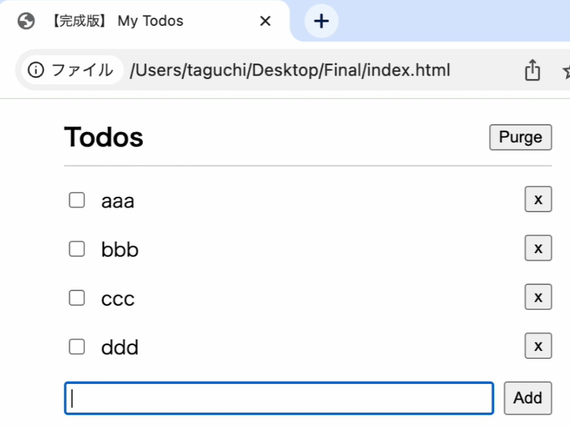

# TODO管理アプリ

HTML・CSS・JavaScriptの基礎を学ぶために作成する、フロントエンド研修用のTODO管理アプリです。

## 主な機能

- TODOの追加
- TODOの完了状態の切り替え
- TODOの削除
- TODOの一括削除

## 参考教材

[JavaScriptでTodo管理アプリを作ろう（ドットインストール）](https://dotinstall.com/lessons/todo_js/64601)

## 完成イメージ

